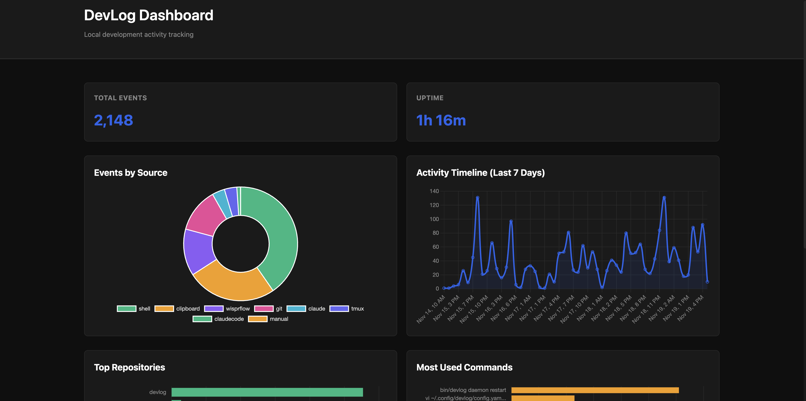

> ⚠️ **An Important Note On This Project**
>
> This isn't necessarily a "production ready" tool yet.  
> DevLog is actively used *by me* every day, but it is still evolving, still rough in places, and still missing features.  
> 
> I've already found a lot of value in having it, but YMMV.

---

<div align="center">

# 📖 DevLog

**Your automated personal development journal**

[](https://go.dev)
[](https://github.com/ayellapragada/devlog/actions)
[](https://goreportcard.com/report/github.com/ayellapragada/devlog)
[](LICENSE)


[Installation](#-installation) • [Quick Start](#-quick-start) • [Architecture](#-architecture) • [Documentation](#-documentation)

</div>

---

## 🎯 Overview

DevLog is a **privacy-first development journaling system** that automatically captures your coding activity and generates intelligent summaries of your work.

```
┌─────────────────────────────────────────────────────────────────┐
│  Your Development Activity                                      │
│  ━━━━━━━━━━━━━━━━━━━━━━━━━                                      │
│                                                                 │
│  git commit -m "fix: auth bug"   ──┐                            │
│  kubectl delete pod web-app        │                            │
│  Claude: "help me optimize..."     ├────▶  Daemon               │
│  copy/paste code snippet           │         │                  │
│  tmux: switch to project-2       ──┘         │                  │
│                                              ▼                  │
│                                          SQLite DB              │
│                                              │                  │
│                                              ▼                  │
│                                         Summarization           │
│                                              │                  │
│                                              ▼                  │
│                               "Fixed authentication bug in      │
│                                user login flow. Implemented     │
│                                token refresh logic..."          │
└─────────────────────────────────────────────────────────────────┘
```

## 📦 Installation

### Prerequisites

- **Go 1.25+**
- **Unix-like OS** - macOS or Linux (Windows support coming, or might already work, who knows)

### Build from Source

```bash
git clone https://github.com/ayellapragada/devlog.git
cd devlog
make build
make install
```

This installs:
- Binary to `~/bin/devlog`
- Config directory at `~/.config/devlog/`
- SQLite database at `~/.config/devlog/events.db`

## 🚀 Quick Start

### 1. Initialize DevLog

```bash
devlog init
```

Creates configuration directory and database.

### 2. Install Modules

Choose which sources to capture from:

```bash
devlog module install git        # Git operations
devlog module install shell      # Shell commands
# ... and many more!
```

### 3. Start the Daemon

```bash
devlog daemon start
```

The daemon runs in the background on `http://localhost:8573`.

### 4. Verify It's Working

```bash
# Check daemon status
devlog daemon status

# View recent events
devlog status

# Search your history
devlog search "npm install"

# See module list
devlog module list
```

### 5. (Optional) Enable Summaries

Install the summarizer plugin:

```bash
devlog plugin install summarizer
```

Configure an LLM provider in `~/.config/devlog/config.yaml`:

An example using local Ollama:

```yaml
plugins:
  summarizer:
    enabled: true
    provider: ollama
    base_url: http://localhost:11434
    model: qwen3:14b
    interval_minutes: 30
    context_window_minutes: 60
```

Using an anthropic key is also supported for those of you that can't help but share more info with big tech companies.

Summaries are automatically generated and saved to `~/.config/devlog/summaries/`.

## 🏗 Architecture

DevLog uses a **modular architecture**.

There are core parts: The CLI, Daemon, and Web server.

By itself those provide no functionality except a foundation.

After that, anything you want needs to be explicitly opted into and enabled.

```
┌─────────────────────────────────────────────────────────────────┐
│                        DevLog Architecture                      │
└─────────────────────────────────────────────────────────────────┘

┌──────────────┐  ┌──────────────┐  ┌──────────────┐
│ Git Hook     │  │ Shell Hook   │  │ Tmux Hook    │
│ (~/.local/   │  │ (PROMPT_     │  │ (~/.tmux.    │
│  bin/git)    │  │  COMMAND)    │  │  conf)       │
└──────┬───────┘  └──────┬───────┘  └──────┬───────┘
       │                 │                 │
       └─────────────────┼─────────────────┘
                         │ HTTP POST
                         ▼
              ┌──────────────────┐
              │  DevLog Daemon   │  ◀── CLI Commands
              │  (Port 8573)     │
              └──────────────────┘
                         │
          ┌──────────────┼──────────────┐
          │              │              │
          ▼              ▼              ▼
   ┌───────────┐  ┌───────────┐  ┌───────────┐
   │  Storage  │  │  Queue    │  │  Plugins  │
   │ (SQLite)  │  │  Manager  │  │           │
   └───────────┘  └───────────┘  └─────-┬────┘
          │                             │
          │                             ▼
          │                    ┌────────────────┐
          │                    │  Summarizer    │
          │                    │  (LLM-powered) │
          │                    └────────┬───────┘
          │                             │
          └─────────────────────────────┘
                         │
                         ▼
              ┌──────────────────┐
              │  Markdown Files  │
              │  ~/.config/      │
              │   devlog/        │
              │   summaries/     │
              └──────────────────┘
```

### Components

#### 🎣 **Modules** - Event Capture

Hook-based (zero polling) examples:
- **git** - Wraps git commands to capture operations
- **shell** - Integrates with shell prompt (Bash/Zsh)

Poll-based (periodic checks) examples:
- **clipboard** - Monitors clipboard for code snippets
- **claude** - Reads Claude Code conversation history

#### 🔌 **Plugins** - Everything Else
Event processing examples:
- **summarizer** - Automated summary generation

#### 🖥 **Daemon**
- HTTP server on localhost:8573
- Manages module pollers and plugin lifecycle
- Graceful shutdown and reload support

- #### 🌐 **Web**
- Also HTTP server on localhost:8573
- Provides dashboard for high level overview

#### 💾 **Storage**
- SQLite database with full-text search (FTS5)

### Web Dashboard

<div align="center">
  
  <p><em>Visualize your development activity with charts</em></p>
</div>

## 📚 Documentation

### Core Guides
- **[Modules](modules/README.md)** - Event capture sources and creating custom modules
- **[Plugins](plugins/README.md)** - Event processing and creating custom plugins

## 🔧 Commands Reference

### Core Commands

```bash
devlog init                          # Initialize configuration
devlog daemon start|stop|restart     # Manage daemon
devlog status [-v] [-n NUM] [-s SRC] # View recent events
```

### Searching Your History

DevLog provides two powerful ways to search your development history:

#### 1. **Full-Text Search** - Fast, structured queries with filters

Search your development history using SQLite FTS5 full-text search with powerful filtering:

```bash
# Simple text search across all events
devlog search "authentication"

# Time-based filtering
devlog search --since 2h                    # Last 2 hours
devlog search --since 7d                    # Last 7 days
devlog search --since 1h30m                 # Last 1.5 hours

# Filter by module and event type
devlog search --module git                  # All git events
devlog search --module git --type commit    # Only git commits
devlog search --type error                  # All error events

# Filter by repository and branch
devlog search --repo myproject              # Events from specific repo
devlog search --branch main                 # Events from main branch
devlog search --repo myproject --branch feature/auth

# Control output
devlog search -n 50                         # Show 50 results (default: 20)
devlog search --sort relevance              # Sort by relevance (default: time_asc)
devlog search --sort time_desc              # Most recent first
devlog search --format json                 # JSON output

# Combine filters for precision
devlog search "auth bug" --repo myproject --branch main --since 7d --module git
devlog search "npm install" --module shell --since 1d --format simple
```

**Search Features:**
- **Full-text search** powered by SQLite FTS5
- **Multiple filters**: time, module, type, repository, branch
- **Flexible time ranges**: supports hours (`h`), minutes (`m`), and days (`d`)
- **Sort options**: by time (ascending/descending) or relevance
- **Output formats**: table (default), JSON, or simple text
- **Pattern matching**: use `*` as wildcard in repo/branch filters

Run `devlog search --help` for the complete reference.

#### 2. **Natural Language Queries** - Ask questions in plain English (LLM-Powered)

Ask questions about your development history naturally and get intelligent, summarized answers.
There is a limit on the number of events that can be summarized.
Realistically, if you ask for a summary of a full week, in it's current state that will break.

If you limit it to a certain time period, things will go more smoothly.

```bash
# Install the query plugin first
devlog plugin install llm      # Base LLM service
devlog plugin install query    # Natural language interface

# Ask questions in natural language
devlog query "What was I working on last?"
devlog query "Show me all git commits from today"
devlog query "What files did I change between 2pm and 4pm?"
devlog query "What errors did I encounter yesterday?"
```

**Query Features:**
- **LLM-powered understanding**: interprets your natural language question
- **Intelligent search planning**: converts questions into structured searches
- **Smart summarization**: synthesizes results into human-readable answers
- **Context-aware**: understands time references ("today", "yesterday", "last week")
- **Works with existing events**: searches your local SQLite database

**Comparison:**

| Feature          | `search`  | `query`           |
|------------------|-----------|-------------------|
| **Speed**        | Instant   | ~2-5 seconds      |
| **Input**        | Flags     | Natural language  |
| **Output**       | Events    | Summary narrative |
| **LLM Required** | No        | Yes               |
| **Best for**     | Filtering | Exploration       |

Use `search` when you know exactly what you're looking for. Use `query` when you want to explore or need a summary.

### Configuration

```bash
devlog config status                 # Display configuration
devlog config edit                   # Edit in $EDITOR
```

### Module Management

```bash
devlog module list                   # List available modules
devlog module install <name>         # Install and enable a module
devlog module uninstall <name>       # Uninstall a module
```

### Plugin Management

```bash
devlog plugin list                   # List available plugins
devlog plugin install <name>         # Install and enable a plugin
devlog plugin uninstall <name>       # Uninstall a plugin
```

## ⚙️ Configuration

Configuration is stored at `~/.config/devlog/config.yaml`:

```yaml
# Daemon settings
daemon:
  port: 8573

# Module configuration
modules:
  git:
    enabled: true

# Plugin configuration
plugins:
  summarizer:
    enabled: false

# Storage settings
storage:
  path: ~/.config/devlog/events.db
```

---

## 🤝 Contributing

Contributions are welcome! See [CONTRIBUTING.md](CONTRIBUTING.md) for development guidelines.

Areas where help is appreciated:

- **Module Development** - New event sources (VS Code, Docker, etc.)
- **Plugin Development** - Export formats, integrations, analytics
- **Testing** - Platform testing, edge cases
- **Documentation** - Guides, examples, tutorials

Please feel free to submit issues or pull requests.

## 🔒 Security

DevLog stores all data locally by default. but supports multiple LLM providers. See [SECURITY.md](SECURITY.md) for:
- Security considerations for local data storage
- API key management best practices
- How to report security vulnerabilities

## 📝 License

MIT License - see [LICENSE](LICENSE) for details.

---

## 🐛 Troubleshooting

### Daemon won't start

```bash
# Check if port is in use
lsof -i :8573

# View daemon logs
tail -f ~/.config/devlog/devlog.log
```

### Events not being captured

```bash
# Verify daemon is running
devlog daemon status

# Check module list
devlog module list

# Test manual event ingestion
devlog ingest test '{"message": "test event"}'

# View recent events
devlog status -v -n 20
```

### Modules not working

```bash
# Reinstall git module
devlog module uninstall git
devlog module install git

# Check shell integration
echo $PROMPT_COMMAND  # Should include devlog

# Verify tmux hooks
tmux show-options -g | grep devlog
```

### Summaries not generating

```bash
# Check plugin status
devlog plugin list

# View logs for errors
tail -f ~/.config/devlog/devlog.log | grep summarizer

# Test LLM connection (for Ollama)
curl http://localhost:11434/api/generate -d '{"model":"qwen3:8b","prompt":"test"}'
```

For more help, [open an issue](https://github.com/ayellapragada/devlog/issues) on GitHub.
